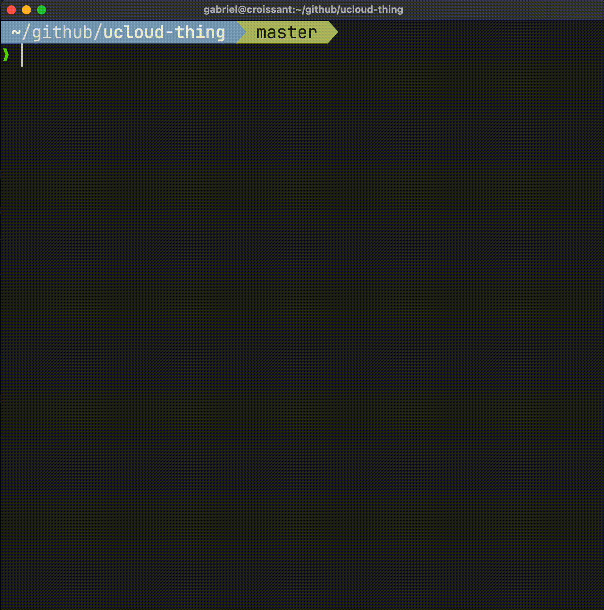
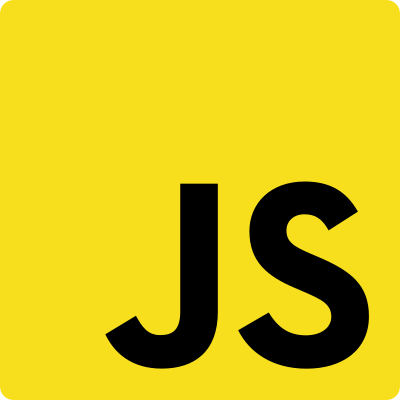
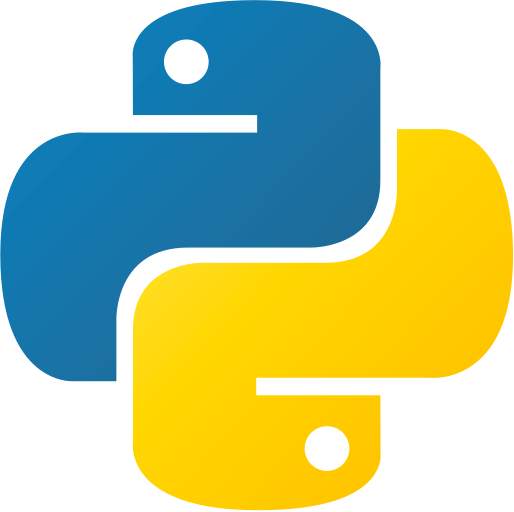
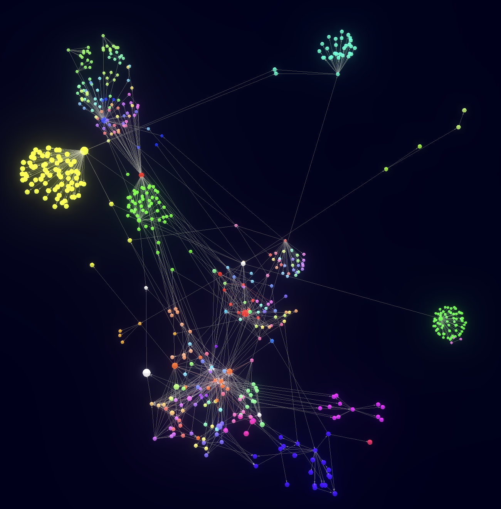
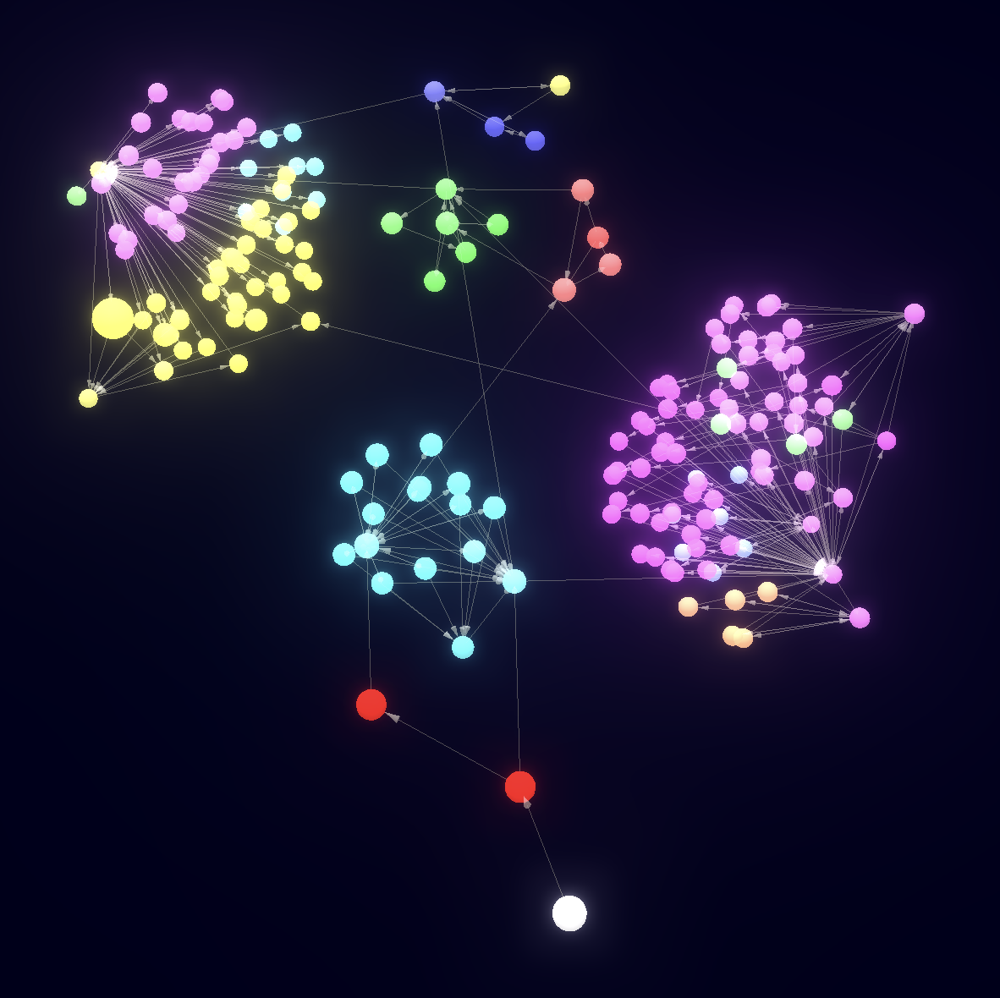
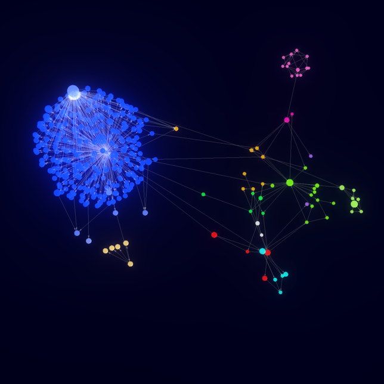
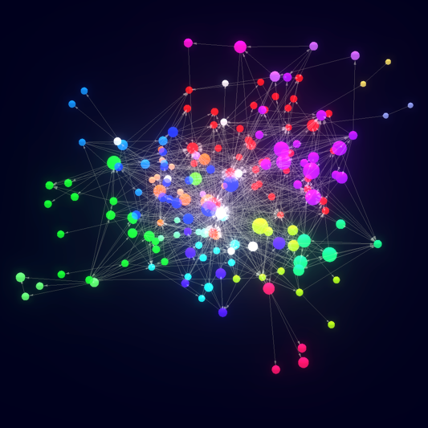
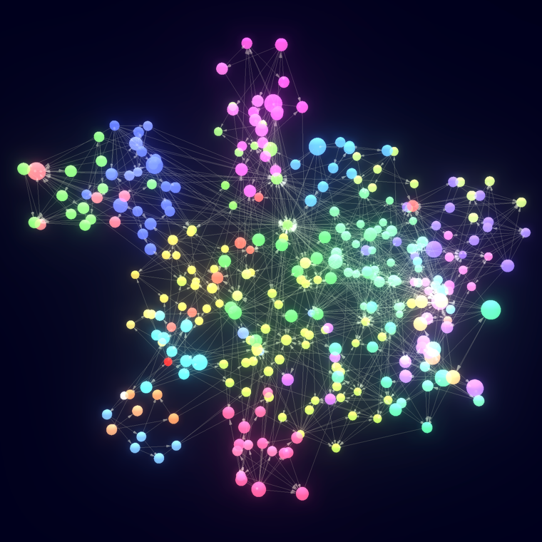

<p align="center">
    
    
</p>

<br/>

<p align="center">
    
    
    
</p>

<p align="center">
    Visualize the <strong>entropy</strong> of a code base with a 3d force-directed graph. 
</p>

<p align="center">
    The more decoupled and modular a code base is, the more spread the graph will look like.
</p>

<p align="center">
    
</p>

<p align="center">
    Ensure your code base decoupling by creating your own rules and enforcing them with <code>dep-tree check</code>
</p>

## Checkout the entropy graph of well-known projects

| Ts/Js                                                                                                            | Python                                                                                                                  | Rust                                                                                                    | Go                                                                                                                      |
|------------------------------------------------------------------------------------------------------------------|-------------------------------------------------------------------------------------------------------------------------|---------------------------------------------------------------------------------------------------------|:------------------------------------------------------------------------------------------------------------------------|
| [typescript](https://dep-tree.s3.amazonaws.com/^0.20.5/microsoft/TypeScript/src/typescript/typescript.ts.html)   | [langchain](https://dep-tree.s3.amazonaws.com/^0.20.5/langchain-ai/langchain/libs/langchain/langchain/__init__.py.html) | [deno](https://dep-tree.s3.amazonaws.com/^0.20.5/denoland/deno/cli/main.rs.html)                        | [Docker buildx](https://dep-tree.s3.amazonaws.com/^0.20.5/docker/buildx/cmd/buildx/main.go.html)                        |
| [react](https://dep-tree.s3.amazonaws.com/^0.20.5/facebook/react/packages/react-dom/index.js.html)               | [pytorch](https://dep-tree.s3.amazonaws.com/^0.20.5/pytorch/pytorch/torch/nn/__init__.py.html)                          | [polars](https://dep-tree.s3.amazonaws.com/^0.20.5/pola-rs/polars/crates/polars-core/src/lib.rs.html)   | [Docker compose](https://dep-tree.s3.amazonaws.com/^0.20.5/docker/compose/cmd/main.go.html)                             |
| [svelte](https://dep-tree.s3.amazonaws.com/^0.20.5/sveltejs/svelte/packages/svelte/src/compiler/index.js.html)   | [tensorflow](https://dep-tree.s3.amazonaws.com/^0.20.5/tensorflow/tensorflow/tensorflow/python/keras/models.py.html)    | [alacritty](https://dep-tree.s3.amazonaws.com/^0.20.5/alacritty/alacritty/alacritty/src/main.rs.html)   | [Kubernetes kubelet](https://dep-tree.s3.amazonaws.com/^0.20.5/kubernetes/kubernetes/cmd/kubelet/app/server.go.html)    |
| [vuejs](https://dep-tree.s3.amazonaws.com/^0.20.5/vuejs/vue/src/core/index.ts.html)                              | [fastapi](https://dep-tree.s3.amazonaws.com/^0.20.5/tiangolo/fastapi/fastapi/__init__.py.html)                          | [bevy (ecs)](https://dep-tree.s3.amazonaws.com/^0.20.5/bevyengine/bevy/crates/bevy_ecs/src/lib.rs.html) | [Ollama](https://dep-tree.s3.amazonaws.com/^0.20.5/ollama/ollama/main.go.html)                                          |
| [angular](https://dep-tree.s3.amazonaws.com/^0.20.5/angular/angular/packages/compiler/index.ts.html)             | [numpy](https://dep-tree.s3.amazonaws.com/^0.20.5/numpy/numpy/numpy/__init__.py.html)                                   | [rocket](https://dep-tree.s3.amazonaws.com/^0.20.5/rwf2/Rocket/core/lib/src/lib.rs.html)                | [Gin](https://dep-tree.s3.amazonaws.com/^0.20.5/gin-gonic/gin/*.go.html)                                                |
| [storybook](https://dep-tree.s3.amazonaws.com/^0.20.5/storybookjs/storybook/code/ui/blocks/src/index.ts.html)    | [scikit-learn](https://dep-tree.s3.amazonaws.com/^0.20.5/scikit-learn/scikit-learn/sklearn/__init__.py.html)            | [axum](https://dep-tree.s3.amazonaws.com/^0.20.5/tokio-rs/axum/axum/src/lib.rs.html)                    | [Go's crypto std](https://dep-tree.s3.amazonaws.com/^0.20.5/golang/go/src/crypto/**/*.go.html)                          |
| [three.js](https://dep-tree.s3.amazonaws.com/^0.20.5/mrdoob/three.js/src/Three.js.html)                          |                                                                                                                         |                                                                                                         | [Dep Tree](https://dep-tree.s3.amazonaws.com/^0.20.5/gabotechs/dep-tree/main.go.html)                                   |
| [expressjs](https://dep-tree.s3.amazonaws.com/^0.20.5/expressjs/express/lib/express.js.html)                     |                                                                                                                         |                                                                                                         | [Cockroach DB SQL parser](https://dep-tree.s3.amazonaws.com/^0.20.5/cockroachdb/cockroach/pkg/sql/parser/parse.go.html) |
| [material-ui](https://dep-tree.s3.amazonaws.com/^0.20.5/mui/material-ui/packages/mui-material/src/index.js.html) |                                                                                                                         |                                                                                                         | [Ethereum](https://dep-tree.s3.amazonaws.com/^0.20.5/ethereum/go-ethereum/cmd/**/*.go.html)                             |
| [eslint](https://dep-tree.s3.amazonaws.com/^0.20.5/eslint/eslint/lib/cli.js.html)                                |                                                                                                                         |                                                                                                         |                                                                                                                         |
| [prettier](https://dep-tree.s3.amazonaws.com/^0.20.5/prettier/prettier/index.js.html)                            |                                                                                                                         |                                                                                                         |                                                                                                                         |

## Supported languages

<div>
    
    
    
    
    
</div>

## Contributing additional languages

If you want to contribute additional languages, there's a guide [here](docs/IMPLEMENTING_NEW_LANGUAGES.md)
that teaches how to implement them with a hands-on example based on a fictional language.

Contributions are always welcome!

## Install

On Mac and Linux, it can be installed using brew:

```shell
brew install dep-tree
```

Alternatively, on any platform including Windows it can be installed with `pip`...

```shell
pip install python-dep-tree
```

...or `npm`:

```shell
npm install @dep-tree/cli
```

## About Dep Tree

`dep-tree` is a cli tool for visualizing the complexity of a code base, and creating
rules for ensuring its loosely coupling.

It works with files, meaning that each file is a node in the dependency tree:

- It starts from one or more entrypoints, which are usually the main executable files in a
  program or the files that expose the contents of a library (like `package/main.py`, `src/index.ts`, `src/lib.rs`...).
- It makes a parent node out of the root file, and one child node for each imported file.

> [!NOTE]
> it only takes into account local files, not files imported from external libraries.

- That process is repeated recursively with all the imported files, until the file dependency
  graph is formed.
- If rendering the **code base entropy**, the nodes will be rendered using a 3d force-directed graph
  in the browser.
- If rendering the **dependency tree** in the terminal, the nodes will be placed in a human-readable
  way, and users can navigate through the graph using the keyboard.
- If validating the **dependency rules** in a CI system, it will check that the dependencies between files
  match some boundaries declared in a `.dep-tree.yml` file.

## Usage

### Entropy

Choose the file that will act as the root of the dependency graph (for example `src/index.ts`), and run:

```shell
dep-tree entropy src/index.ts
```

You can also pass multiple files if you don't have a single entrypoint:

```shell
dep-tree entropy src/*
```

It will open a browser window and will render your file dependency graph using a 3d force-directed graph.

The spheres (files) will be placed mimicking some attraction/repulsion forces. Some parts of your code
base will tend to gravitate together if they are tightly coupled, and will tend to be separated if
they are loosely coupled.

The 3d graph for a clean code base will have groups of nodes clustered together and clearly separated
from other clusters:

<div>
    
    
    
</div>

The 3d graph for a tightly coupled code base will have all the nodes grouped together with no
clustering and no clear separation between them:

<div>
    
    
    
</div>

### Explain

Given two pieces of code, displays what are the dependencies between them, for example:

```shell
dep-tree explain 'src/products/**/*.go' 'src/orders/**/*.go'
```

> [!WARNING]  
> Make sure you wrap the two glob patterns with single quotes ('') or double quotes (""),
> otherwise your shell might expand the globstars, and `dep-tree explain` will receive
> an incorrect number of arguments.


This command will display what Golang files under the `src/products` directory depend on
other Golang files under the `src/orders` directory.

It will output something like this:
```shell
src/products/books/book.go -> src/orders/renting.go
src/products/price.go  -> src/orders/order_manager.go
src/products/storage.go -> src/orders/order_manager.go
```

### Tree

Choose the file that will act as the root of the dependency graph (for example `my-file.py`), and run:

```shell
dep-tree tree my-file.py
```

You can see the controls for navigating through the graph pressing `h` at any time:

```
j      -> move one step down
k      -> move one step up
Ctrl d -> move half page down
Ctrl u -> move half page up
Enter  -> select the current node as the root node
q      -> navigate backwards on selected nodes or quit
h      -> show this help section
```

### Check

The dependency linting can be executed with:

```shell
dep-tree check
```

This is specially useful for CI systems, for ensuring that parts of an application that
should not be coupled remain decoupled as the project evolves.

These are the parameters that can be configured in the `.dep-tree.yml` file:

### `entrypoints`:

List of entrypoints that will act as root nodes for evaluating multiple
dependency trees. Some applications might expose more than one entrypoint, for that reason,
this parameter is a list. The most typical thing is that there is only one entrypoint.

### `allow`:

Map from glob pattern to list of glob patterns that define, using a "white list"
logic, what files can depend on what other files. For example:

```yml
check:
  allow:
    "src/products/**":
      - "src/products/**"
      - "src/common/**"
```

In the example above, any file under the `src/products` folder has the restriction of only
being able to import files that live either in the same `src/products` folder, or in the
`src/common` folder.

### `deny`:

Map from glob pattern to list of glob patterns that define, using a "black list"
logic, what dependencies are forbidden. For example:

```yml
check:
  deny:
    "api/routes.py":
      - "adapters/**"
```

In the example above, the file `api/routes.py` can import from anywhere but the `adapters` folder.

### `allowCircularDependencies`:

Boolean parameter that defines whether circular dependencies are allowed or not. By default
they are not allowed.

```yml
check:
  allowCircularDependencies: true
```

### `aliases`:

Map from string to glob pattern that gathers utility groups of glob patterns that
can be reused in the `deny` and `allow` fields. For example:

```yml
check:
  aliases:
    "common-stuff":
      - "src/common/**"
      - "src/utils/**"
      - "src/helpers/**"
  allow:
    "src/function.py":
      - "common-stuff"
      - "src/class.py"
```

is the same as saying:

```yml
check:
  allow:
    "src/function.py":
      - "src/common/**"
      - "src/utils/**"
      - "src/helpers/**"
      - "src/class.py"
```

### Example configuration file

Dep Tree by default will read the configuration file in `.dep-tree.yml`, which is expected to be a file
that contains the following settings:

```yml
# Files that should be completely ignored by dep-tree. It's fine to ignore
# some big files that everyone depends on and that don't add
# value to the visualization, like auto generated code.
exclude:
  - 'some-glob-pattern/**/*.ts'

# Whether to unwrap re-exports to the target file or not.
# Imagine that you have the following setup:
#
#  src/index.ts     -> import { foo } from './foo'
#  src/foo/index.ts -> export { bar as foo } from './bar'
#  src/foo/bar.ts   -> export function bar() {}
#
# If `unwrapExports` is true, a dependency will be created from
# `src/index.ts` to `src/foo/bar.ts`, and the middle file `src/foo/index.ts`
# will be ignored, as it's just there for re-exporting the `bar` symbol,
# which is actually declared on `src/foo/bar.ts`
#
# If `unwrapExports` is false, re-exported symbols will not be traced back
# to where they are declared, and instead two dependencies will be created:
# - from `src/index.ts` to `src/foo/index.ts`
# - from `src/foo/index.ts` to `src/foo/bar.ts`
#
# Entropy visualization tends to lead to better results if this is set to `false`,
# but CLI rendering is slightly better with this set to `true`.
unwrapExports: false

# Check configuration for the `dep-tree check` command. Dep Tree will check for dependency
# violation rules declared here, and fail if there is at least one unsatisfied rule.
check:
  # These are the entrypoints to your application. Dependencies will be checked with
  # these files as root nodes. Typically, an application has only one entrypoint, which
  # is the executable file (`src/index.ts`, `main.py`, `src/lib.rs`, ...), but here
  # you can declare as many as you want.
  entrypoints:
    - src/index.ts

  # Whether to allow circular dependencies or not. Languages typically allow
  # having circular dependencies, but that has an impact in execution path
  # traceability, so you might want to disallow it.
  allowCircularDependencies: false

  # map from glob pattern to array of glob patterns that determines the exclusive allowed
  # dependencies that a file matching a key glob pattern might have. If file that
  # matches a key glob pattern depends on another file that does not match any of
  # the glob patterns declared in the values array, the check will fail.
  allow:
    # example: any file in `src/products` can only depend on files that are also
    # in the `src/products` folder or in the `src/helpers` folder.
    'src/products/**':
      - 'src/products/**'
      - 'src/helpers/**'

  # map from glob pattern to array of glob patterns that determines forbidden
  # dependencies. If a file that matches a key glob pattern depends on another
  # file that matches at least one of the glob patterns declared in the values
  # array, the check will fail.
  deny:
    # example: files inside `src/products` cannot depend on files inside `src/users`,
    # as they are supposed to belong to different domains.
    'src/products/**':
      - 'src/users/**'

  # typically, in a project, there is a set of files that are always good to depend
  # on, because they are supposed to be common helpers, or parts that are actually
  # designed to be widely depended on. This allows you to create aliases to group
  # of files that are meant to be widely depended on, so that you can reference
  # them afterward in the `allow` or `deny` sections.
  aliases:
    # example: this 'common' entry will be available in the other sections:
    #
    # check:
    #   allow:
    #     'src/products/**':
    #       - 'common'
    'common':
      - 'src/helpers/**'
      - 'src/utils/**'
      - 'src/generated/**'

# JavaScript and TypeScript specific settings.
js:
  # Whether to take package.json workspaces into account while resolving paths
  # or not. You might want to disable it if you only want to analyze one workspace
  # in a monorepo.
  workspaces: true
  # Whether to follow tsconfig.json paths or not. You will typically want to
  # enable this, but for some monorepo setups, it might be better to leave this off
  # if you want to analyze only one package.
  tsConfigPaths: true

# Python specific settings.
python:
  # Whether to take into account conditional imports as dependencies between files or not.
  # A conditional import is an `import` statement that is wrapped inside an `if` block or
  # a function, for example:
  #
  # if SHOULD_IMPORT:
  #     from foo import *
  #
  # by default these statements introduce a dependency between importing and imported file,
  # but depending on your use case you might want to disable it.
  excludeConditionalImports: false

# Rust specific settings.
rust:
# None available at the moment.
```

## Motivation

As codebases expand and teams grow, complexity inevitably creeps in.
While maintaining a cohesive and organized structure is key to
a project's scalability and maintainability,
the current developer toolbox often falls short in one critical
area: file structure and dependency management.

Luckily, the community has come up with very useful tools
for keeping our projects in check:

- **Type checkers** ensure correct interactions between code segments.
- **Linters** elevate code quality and maintain a consistent style.
- **Formatters** guarantee a uniform code format throughout.
- But what about file structure and file dependency management...

Dep Tree is a dedicated tool addressing this very challenge,
it aids developers in preserving a project's structural integrity
throughout its lifecycle. And with integration capabilities in CI systems,
the tool ensures that this architectural "harmony" remains undisturbed.

## Supported languages

- Python
- JavaScript/TypeScript (es imports/exports)
- Rust (beta)

